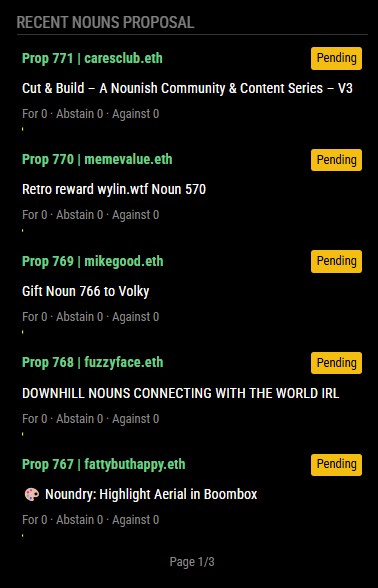

# MMM-NounsProposal

A [MagicMirror²](https://github.com/MichMich/MagicMirror) module that displays recent Nouns DAO governance proposals with voting information.

## Screenshot



## Features

- Displays latest Nouns DAO governance proposals
- Shows voting progress with visual indicators
- Pagination for viewing multiple proposals
- Auto-cycling between pages
- Displays proposal status, vote counts, and quorum indicators
- Configurable display options
- Fetches real-time data from Nouns DAO blockchain and API
- ENS name resolution for proposal creators

## Installation

1. Navigate to your MagicMirror's modules folder:
```bash
cd ~/MagicMirror/modules/
```

2. Clone this repository:
```bash
git clone https://github.com/XppaiCyberr/MMM-NounsProposal.git
```

3. Install dependencies:
```bash
cd MMM-NounsProposal
npm install
```

4. Add the module to your `config/config.js` file:
```javascript
{
    module: "MMM-NounsProposal",
    position: "top_right",
    config: {
        // See configuration options below
    }
}
```

## Configuration

| Option             | Description                                               | Default     |
|--------------------|-----------------------------------------------------------|-------------|
| `updateInterval`   | How often to fetch new data (in milliseconds)             | `300000` (5 minutes) |
| `header`           | Text to display at the top of the module                  | `"Recent Nouns Proposals"` |
| `maxProposals`     | Total number of proposals to fetch                        | `10` |
| `proposalsPerPage` | Number of proposals to display per page                   | `5` |
| `cycleInterval`    | Time between page changes (in milliseconds)               | `10000` (10 seconds) |
| `animationSpeed`   | Speed of page transition animations (in milliseconds)     | `2000` (2 seconds) |
| `minProposalsPerPage` | Minimum proposals per page to enable cycling           | `2` |
| `showProposer`     | Whether to display the proposer information               | `true` |
| `showRawData`      | Debug option to show raw proposal data                    | `false` |

## Example Configuration

```javascript
{
    module: "MMM-NounsProposal",
    position: "top_right",
    config: {
        header: "Recent Nouns Proposals",
        maxProposals: 10,
        proposalsPerPage: 3,
        cycleInterval: 15000,
        showProposer: true
    }
}
```

## How It Works

This module connects to the Ethereum mainnet to retrieve Nouns DAO proposal information:

1. It queries the Nouns governance contract to get the latest proposal ID
2. Fetches detailed proposal data from the Nouns API
3. Resolves ENS names for proposal creators when available
4. Processes voting data to show progress bars and percentages
5. Displays the information in an easily readable format

## Dependencies

The module requires the following dependencies (automatically installed with `npm install`):
- axios (^1.6.7): For making API requests to the Nouns API
- viem (^2.7.9): For interacting with the Ethereum blockchain

## Customization

The appearance of the module can be customized by modifying the `MMM-NounsProposal.css` file.

## Development

Feel free to contribute to this module by submitting pull requests or reporting issues on GitHub.

## Acknowledgments
- https://api.nouns.biz/ for the Proposal API


## License

MIT